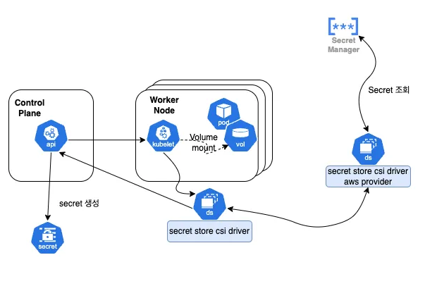

## AWS Secrets Manager?

AWS Secrets Manager 는 데이터베이스 혹은 어플리케이션에서 사용하는 인증 정보, API Key, Oauth Token 등을 저장하고, 사용할 수 있는 키 관리 서비스입니다.

Secrets Manager에 비밀 키를 저장함으로써, 어플리케이션 코드에 하드코딩하지 않아도 쉽게 조회하고, 교체할 수 있습니다.

- Ref:  [**AWS Secrets Manager란 무엇인가요?**](https://docs.aws.amazon.com/ko_kr/secretsmanager/latest/userguide/intro.html)


## Secrets Store CSI Driver?

Kubernetes Secrets Store CSI Driver는 컨테이너 스토리지 인터페이스 (CSI) 볼륨을 통해 external key store 와 kubernetes secret을 통합하는 역할을 합니다.

- Ref: [**Kubernetes Secrets Store CSI Driver**](https://secrets-store-csi-driver.sigs.k8s.io/)


## AWS Provider for Secret Store CSI Driver

Secrets Store CSI Driver가 외부 비밀 키를 Kubernetes Secrets과 통합하는 역할을 한다면, AWS Provider for Secret Store CSI Driver는 AWS Secrets Manager를 조회하고, CSI Driver에게 전달하는 역할을 합니다.


전체적인 그림을 보면 다음과 같습니다.




## Install 

설치의 경우, AWS Provider와, CSI Driver 모두 각각 설치해주어야 합니다. 설치 방법은 아래 문서를 참고해주세요.

- https://github.com/aws/secrets-store-csi-driver-provider-aws
- https://github.com/kubernetes-sigs/secrets-store-csi-driver


## **Kubernetes에서 AWS Secrets Manager 비밀 값 사용**

------

### 1. SecretProviderClass 생성하기

SecretProviderClass 란, AWS Secrets Manager에서 어떤 Secrets에 어떤 Key를 사용할 것인지 정의하는 CRD 입니다.

**예시)** `dev/grafana/web` 이라는 이름의 Secret Manager에 저장된 `GOOGLE_OAUTH_CLIENT_SECRET`  Key를 kubernetes의 secret `grafana-dev-web-google-oauth-secret` 으로 만드는 CRD 입니다.

```yaml
apiVersion: secrets-store.csi.x-k8s.io/v1
kind: SecretProviderClass
metadata:
  name: grafana-web-aws-secrets
  namespace: grafana
spec:
  provider: aws
  parameters:
    objects: |
      - objectName: "dev/grafana/web"
        objectType: "secretsmanager"
        jmesPath:
          - path: "GOOGLE_OAUTH_CLIENT_SECRET"
            objectAlias: "GOOGLE_OAUTH_CLIENT_SECRET"
  secretObjects:
    - secretName: grafana-dev-web-google-oauth-secret
      type: Opaque
      data:
      - key: "GOOGLE_OAUTH_CLIENT_SECRET"
        objectName: "GOOGLE_OAUTH_CLIENT_SECRET"
```

- `name`: CRD 이름을 입력합니다.
- `namespace`: secret을 사용할 Pod와 같은 네임스페이스로 입력합니다.
- `parameters`: AWS Secrets Manager의 값을 기입합니다.
  - `objectName`: AWS Secrets Manager의 secret name을 입력합니다.
  - `objectType`: `secretsmanager` or `ssmparameter`
  - `jmesPath`: secret 값이 Key/Value 형태일 경우, `path` 에 Key Name을 입력합니다.
- `secretObjects`: Kubernetes의 Secret 생성을 위한 정보를 기입합니다. (secret 생성이 필요없으면 생략)
  - `secretName` : secret으로 생성될 이름을 입력합니다.
  - `key`: secret으로 생성될 key name을 입력합니다.
  - `objectName`: `parameters`에서 입력한 `jmesPath`의 `objectAlias` 를 입력합니다.


### 2. Pod에 Secrets 마운트하기

**예시)** 위에서 생성한 CRD를 사용하여 Secrets을 생성하도록 마운트합니다.

```yaml
apiVersion: v1
kind: Pod
  name: grafana-web-dev-0
  namespace: grafana
spec:
  containers:
  - name: grafana
    env:
    - name: GOOGLE_OAUTH_CLIENT_SECRET
      valueFrom:
        secretKeyRef:
          key: GOOGLE_OAUTH_CLIENT_SECRET
          name: grafana-dev-web-google-oauth-secret
    volumeMounts:
    - mountPath: /mnt/google-oauth-secret
      name: secrets-store
      readOnly: true
  volumes:
    - name: secrets-store
      csi:
        driver: secrets-store.csi.k8s.io
        readOnly: true
        volumeAttributes:
          secretProviderClass: grafana-web-dev-aws-secret
```


secrets store csi driver에서 aws secrets 값을 사용하기 위해서는 생성한 `SecretProviderClass` CRD 정보로 파드에 volume을 설정 해야 합니다.

```yaml
  volumes:
    - name: secrets-store
      csi:
        driver: secrets-store.csi.k8s.io
        readOnly: true
        volumeAttributes:
          secretProviderClass: grafana-web-dev-aws-secret
```

그리고 볼륨을 컨테이너에 마운트합니다.


컨테이너에 마운트까지 완료되어야, secrets store csi driver가 secrets을 조회하고, kubernetes secret resource를 생성합니다. **(마운트하지 않으면 secret은 생성되지 않습니다.)**

```yaml
spec:
  containers:
  - name: grafana
    volumeMounts:
    - mountPath: /mnt/google-oauth-secret
      name: secrets-store
      readOnly: true
```


마운트된 파일을 통해 시크릿 값을 가져오거나, 생성된 secret을 환경 변수로 사용할 수 있습니다.

```yaml
spec:
  containers:
  - name: grafana
    env:
    - name: GOOGLE_OAUTH_CLIENT_SECRET
      valueFrom:
        secretKeyRef:
          key: GOOGLE_OAUTH_CLIENT_SECRET
          name: grafana-dev-web-google-oauth-secret
```

