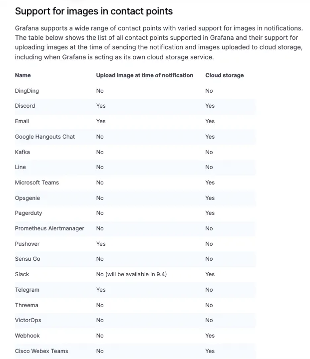

## Grafana Image Renderer란?

헤드리스 브라우저(Chromium)를 사용하여 패널을 PNG로 렌더링하는 Grafana Plugin

- [Use images in notifications | Grafana documentation](https://grafana.com/docs/grafana/v9.2/alerting/images-in-notifications/)


과거 버전의 Grafana는 기본적으로 Alert에 Image를 포함하도록 하는 옵션이 제공되었으나, 최신 버전에서는 해당 기능이 제공되지 않도록 변경되었다. 그렇기 때문에 Alert에 패널 이미지를 포함시키려면 Image Renderer를 구성해야한다.


## 요구 사항

- Grafana >= 9.0
  - 8에서 이미지 포함한 alert 지원이 제거 되었다가, 9.0부터 다시 지원 시작
- Grafana renderer plugin
- external storage (아래 표 참고)




## 구성

Grafana Image Renderer는 헤드리스 브라우저로 패널 이미지를 캡쳐하고, external storage (S3)에 저장한다.

실제 Alert에 포함되는 이미지는 external storage에서 호스팅되어 노출되는 형태이다.


즉, 사전에 external storage가 생성되어야하고, Alert이 수신되는 메신저 (Slack, Teams 등)에서 external storage에 Access 할 수 있어야 한다.


이 예제에서는 docker-compose로 image-renderer를 구성하였음.

```yaml
version: "3"
services:
  grafana:
    build:
      context: ./
    volumes:
      - ./data/grafana.db:/var/lib/grafana/grafana.db
      - ./files/grafana.ini:/etc/grafana/grafana.ini
    environment:
      GF_EXTERNAL_IMAGE_STORAGE_PROVIDER: s3
      GF_EXTERNAL_IMAGE_STORAGE_S3_BUCKET: grafana-alert-image
      GF_EXTERNAL_IMAGE_STORAGE_S3_REGION: ap-northeast-2
      GF_RENDERING_SERVER_URL: http://grafana-renderer:8081/render
      GF_RENDERING_CALLBACK_URL: http://grafana:3000/
      GF_INSTALL_PLUGINS: grafana-image-renderer
      GF_ALERTING_ENABLED: false
      GF_UNIFIED_ALERTING_ENABLED: false
      GF_UNIFIED_ALERTING_SCREENSHOTS_CAPTURE: true
      GF_UNIFIED_ALERTING_SCREENSHOTS_UPLOAD_EXTERNAL_IMAGE_STORAGE: true
    ports:
      - 3000:3000
  grafana-renderer:
    container_name: grafana-renderer
    image: grafana/grafana-image-renderer:latest
    ports:
      - 8081
```

- `environment` 에 s3 구성 정보 및, renderer 설정 정보 추가
  - 참고 : [Grafana Image Renderer plugin for Grafana | Grafana Labs](https://grafana.com/grafana/plugins/grafana-image-renderer/)


## Template

이미지를 Alert에 포함하려면 Message Template을 통해 아래의 변수를 사용하면 된다.

- 기존 template 하단에 image 추가

``````
{{ .Image }}
``````

